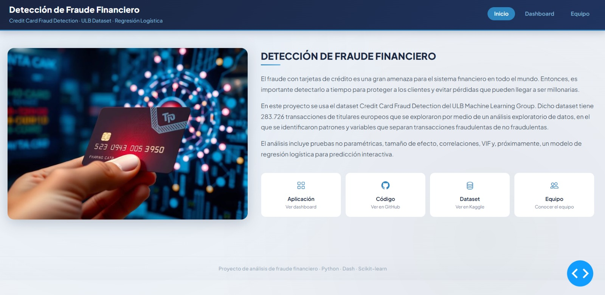

# Fraud Detection Dashboard

**Detección de Fraude Financiero con Tarjetas de Crédito**



---

## Descripción del Proyecto

El fraude con tarjetas de crédito es una gran amenaza para el sistema financiero en todo el mundo. Entonces, es importante detectarlo a tiempo para proteger a los clientes y evitar pérdidas que pueden llegar a ser millonarias.

En este proyecto se usa el dataset **Credit Card Fraud Detection del ULB Machine Learning Group**. Dicho dataset tiene 283.726 transacciones de titulares europeos que se exploraron por medio de un análisis exploratorio de datos, en el que se identificaron patrones y variables que separan transacciones fraudulentas de no fraudulentas.

El análisis incluye pruebas no paramétricas, tamaño de efecto, correlaciones, VIF y, próximamente, un modelo de regresión logística para predicción interactiva.

El análisis incluye:
- Análisis Exploratorio de Datos (EDA)
- Pruebas no paramétricas
- Tamaño de efecto
- Correlaciones y VIF (Factor de Inflación de la Varianza)
- *(Próximamente)* Modelo de regresión logística para predicción interactiva

---

## Dataset

El dataset utilizado es el [Credit Card Fraud Detection](https://www.kaggle.com/datasets/mlg-ulb/creditcardfraud) del ULB Machine Learning Group, disponible en Kaggle.

> **Nota:** El archivo `creditcard.csv` no está incluido en el repositorio por su tamaño. Descárguelo directamente desde Kaggle y colóquelo en la carpeta `data/`.

---

## Estructura del Proyecto

```
fraud_dashboard/
├── app.py                  # Punto de entrada de la aplicación
├── requirements.txt        # Dependencias del proyecto
├── assets/
│   └── custom.css          # Estilos personalizados
├── data/
│   ├── data_loader.py      # Carga y preprocesamiento de datos
│   └── __init__.py
├── model/
│   ├── train_model.py      # Entrenamiento del modelo (próximamente)
│   └── __init__.py
└── tabs/
    ├── home.py             # Página de inicio
    ├── introduccion.py     # Introducción al problema
    ├── contexto.py         # Contexto del fraude financiero
    ├── problema.py         # Planteamiento del problema
    ├── objetivos.py        # Objetivos del proyecto
    ├── marco_teorico.py    # Marco teórico
    ├── metodologia.py      # Metodología
    ├── dataset.py          # Exploración del dataset
    ├── eda.py              # Análisis exploratorio de datos
    ├── resultados.py       # Resultados del análisis
    ├── prediccion.py       # Módulo de predicción (próximamente)
    ├── conclusiones.py     # Conclusiones
    ├── limitaciones.py     # Limitaciones del estudio
    └── __init__.py
```

---

## Cómo ejecutar la aplicación

**1. Clonar el repositorio**

```bash
git clone https://github.com/alemengo76/FraudDetection.git
cd FraudDetection
```

**2. (Opcional) Crear un entorno virtual**

```bash
conda create -n fraud_dash python=3.11
conda activate fraud_dash
```

**3. Instalar las dependencias**

```bash
pip install -r requirements.txt
```

**4. Descargar el dataset**

Descarga `creditcard.csv` desde [Kaggle](https://www.kaggle.com/datasets/mlg-ulb/creditcardfraud) y colócalo en la carpeta `data/`.

**5. Ejecutar la aplicación**

```bash
python app.py
```

**6. Abrir en el navegador**

```
http://localhost:8050/
```

---

## Equipo

Este proyecto fue desarrollado por:

- **Alejandra Meneses Gómez** — [LinkedIn](https://www.linkedin.com/in/alejandra-meneses-gómez-aaa97b3b7/) · [GitHub](https://github.com/alemengo76)
- **Mariangel Yepes Negrete** — [GitHub](https://github.com/Mary-Yepes)
